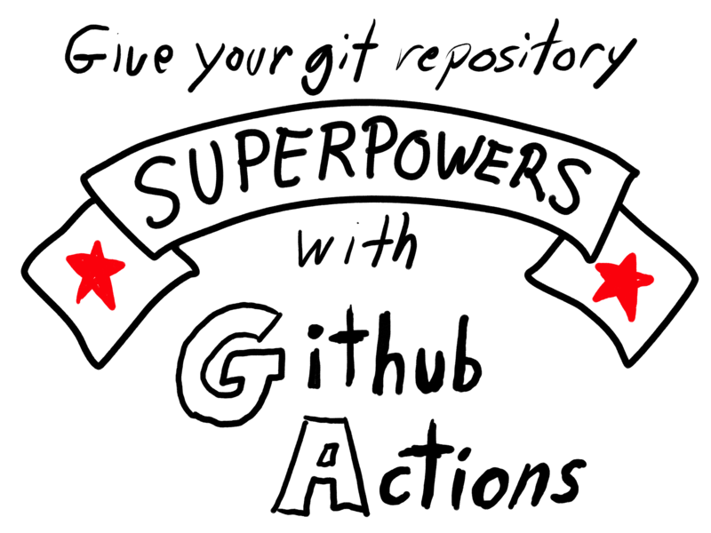
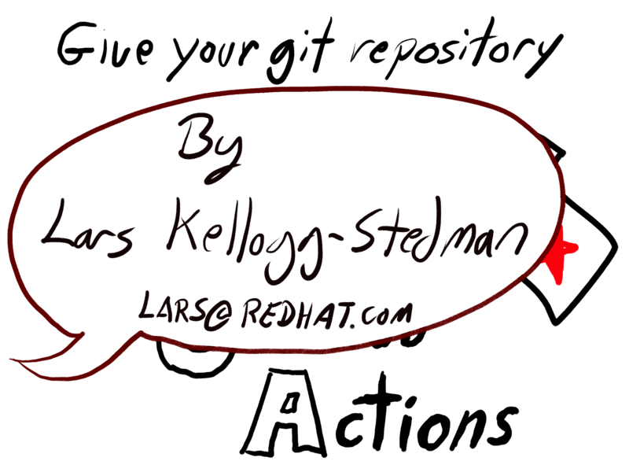
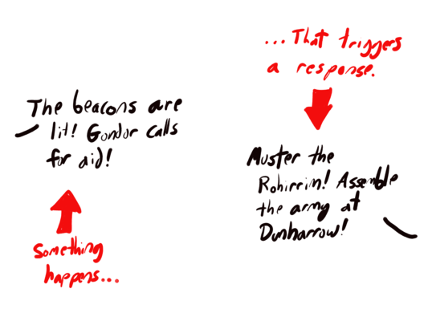
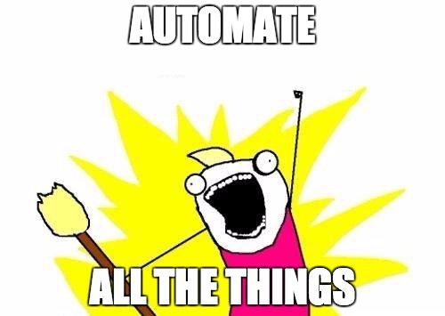

class: middle, center

# Introduction to GitHub Actions

Lars Kellogg-Stedman <lars@redhat.com>

.nodecoration[
- Slides: <http://oddbit.com/intro-to-github-actions/>
- Source: <https://github.com/larsks/intro-to-github-actions>
]

---



---



---

# What are GitHub Actions?

"GitHub Actions" let you create workflows that execute logic in response to certain events.



---

# What are GitHub Actions?

"GitHub Actions" let you create workflows that execute logic in response to certain events.

Events include:

- When someone creates a pull request
- When code is pushed to a repository
- When someone comments on an issue
- In response to a schedule

But there are [many, many] others.

[many, many]: https://docs.github.com/en/actions/using-workflows/events-that-trigger-workflows

---

# Why use GitHub Actions?



---

# Why use GitHub Actions?

Code testing!

- Ensure *your* code works
- Ensure *other people's* code works

---

# Why use GitHub Actions?

Not just for testing:

- Publish documentation
- Create release binaries, container images, etc
- Increase security
- Enforce policy

---

# How do they work?

A [workflow] is defined via [YAML] files that live in the `.github/workflows` directory of your repository.

```
$ tree .github
.github
└── workflows
    ├── precommit.yaml
    └── validate-manifests.yaml
```

[yaml]: https://en.wikipedia.org/wiki/YAML
[workflow]: https://docs.github.com/en/actions/using-workflows/about-workflows

---

# Basic structure

```yaml
name: An example workflow

# Triggers that will cause the workflow to run
on:
  ...

# Jobs that will run in response to the triggers
jobs:
  my-first-job:
    runs-on: ubuntu-latest

    # The job will execute these steps (in sequence)
    steps:
      - name: step1
        ...
      - name: step2
        ...
```

---

# Basic structure

- `ubuntu-linux` is the standard Linux runtime.
- There are [other Github hosted runners] available

[other GitHub hosted runners]: https://docs.github.com/en/actions/using-github-hosted-runners/about-github-hosted-runners/about-github-hosted-runners#using-a-github-hosted-runner

---

# Basic structure

- `jobs` run in parallel
- `steps` are serialized
- There are [resource limits] for the free tier, but they are not typically a problem
  - Max 6 hours for a job
  - Max 35 days for a workflow
  - Max of 20 concurrent jobs

[resource limits]: https://docs.github.com/en/actions/learn-github-actions/usage-limits-billing-and-administration

---

# Structure of a typical job

- Check out your code
- Configure language environment
- Install dependencies
- Do The Thing

---

# Example 1: Syntax validation

Our first example comes from the [`nerc-rates` repository][nerc-rates]. We're looking at the "[Validate rates file]" workflow.

[nerc-rates]: https://github.com/CCI-MOC/nerc-rates
[validate rates file]: https://github.com/CCI-MOC/nerc-rates/blob/main/.github/workflows/validate-rates.yaml

```
name: Validate rates file
on:
  push:
    paths:
      - rates.yaml
  pull_request:
    paths:
      - rates.yaml
```

This runs on pushes and pull requests if they modify the `rates.yaml` file.

---

# Example 1: Syntax validation

A workflow consists of one or more jobs:

```
jobs:
  validate-rates-file:
    name: Validate rates file
    runs-on: ubuntu-latest
```

This job runs in the `ubuntu-latest` environment.

---

# Example 1: Syntax validation

A job consists of a series of steps. First, we check out the repository:

```
    steps:
      - name: Check out code
        uses: actions/checkout@v4
```

---

# Example 1: Syntax validation

Next we set up the language environment and install dependencies:

```
      - name: Set up python
        uses: actions/setup-python@v5
        with:
          python-version: '3.10'

      - name: Install dependencies
        run: |
          pip install -e .
```

---

# Example 1: Syntax validation

Finally, we execute the check itself:

```
      - name: Validate rates file
        run: |
          validate-rates-file -g rates.yaml
```

We can view [success] or [failure] in the browser.

[success]: https://github.com/CCI-MOC/nerc-rates/actions/runs/9600004249
[failure]: https://github.com/CCI-MOC/nerc-rates/actions/runs/9406288272

---

# Example 2: Build a container image

The MOC [ansible-switches-auto-deploy] repository uses a GitHub Actions workflow to build a container image whenever commits are pushed to the main branch.

```
name: Create and publish a container image

on:
  push:
    branches:    
      - main

env:
  REGISTRY: ghcr.io
  IMAGE_NAME: ${{ github.repository }}
```

`github.repository` is referring to a value in the GitHub [context].

[ansible-switches-auto-deploy]: https://github.com/CCI-MOC/ansible-switches-auto-deploy
[context]: https://docs.github.com/en/actions/learn-github-actions/contexts

---

# Example 2: Build a container image

The start of the job should look familiar:

```
jobs:
  build-and-push-image:
    runs-on: ubuntu-latest
    permissions:
      contents: read
      packages: write

    steps:
      - name: Checkout repo
        uses: actions/checkout@v4
```

---

# Example 2: Build a container image

Log in to the container registry:

```
      - name: Log in to Container registry
        uses: docker/login-action@v3
        with:
          registry: ${{ env.REGISTRY }}
          username: ${{ github.actor }}
          password: ${{ secrets.GITHUB_TOKEN}}
      
```

---

# Example 2: Build a container image

Gather metadata about the image:

```
      - name: Extract metadata (tags, labels) for image
        id: meta
        uses: docker/metadata-action@v5
        with:
          images: ${{ env.REGISTRY }}/${{ env.IMAGE_NAME }}
          tags: |
            type=ref,event=branch
            type=sha
      
```

---

# Example 2: Build a container image

Build and push the image:

```
      - name: Build and push container image
        uses: docker/build-push-action@v5
        with:
          context: .
          file: ./Containerfile
          push: true
          tags: ${{ steps.meta.outputs.tags }}
          labels: ${{ steps.meta.outputs.labels }}
```

---

# Interlude 1: Secrets

In the previous workflow, we needed credentials to authenticate to the container registry:

```
      - name: Log in to Container registry
        uses: docker/login-action@v3
        with:
          registry: ${{ env.REGISTRY }}
          username: ${{ github.actor }}
          password: ${{ secrets.GITHUB_TOKEN}}
      
```

In the above step, `${{ secrets.GITHUB_TOKEN }}` is an example of using a [GitHub secret].

[github secret]: https://docs.github.com/en/actions/security-guides/using-secrets-in-github-actions

---

# Interlude 1: Secrets

- The `GITHUB_TOKEN` secret is provided automatically; it grants access to the current repository. 
- You can define your own secrets at the [repository] level, the [environment] level, and the [organization] level.
- Useful for providing credentials to access other services (container image registries, web services, etc)
- Secrets are "write only" in the web  ui (you can replace them, but you cannot view them)

[repository]: https://docs.github.com/en/codespaces/managing-codespaces-for-your-organization/managing-encrypted-secrets-for-your-repository-and-organization-for-codespaces#adding-secrets-for-a-repository
[environment]: https://docs.github.com/en/actions/deployment/targeting-different-environments/using-environments-for-deployment
[organization]: https://docs.github.com/en/codespaces/managing-codespaces-for-your-organization/managing-encrypted-secrets-for-your-repository-and-organization-for-codespaces#adding-secrets-for-an-organization

---

# Example 2: Running pre-commit checks

A common use case for GitHub workflows is to run some basic checks on pull requests (this is called "linting"). The following workflow makes use of the [pre-commit] tool, which applies checks defined in a `.pre-commit-config.yaml` file.

This example from the [OpenShift on NERC] project.

[pre-commit]: https://pre-commit.com/
[openshift on nerc]: https://github.com/OCP-on-NERC/workflows/blob/main/.github/workflows/precommit.yaml

```
name: Run pre-commit checks

on:
  push:
  pull_request:
  workflow_call:
```

This workflow runs for pushes and pull requests (but can also be triggered manually or called from another workflow).

---

# Example 2: Running pre-commit checks

```
jobs:
  run-linters:
    runs-on: ubuntu-latest
    steps:
      - name: Check out code
        uses: actions/checkout@v4

      - name: Setup Python
        uses: actions/setup-python@v5
        with:
          python-version: "3.12"
```

We've seen all this before.

---

# Example 2: Running pre-commit checks

Installing dependencies can dramatically increase the runtime of your workflows. GitHub provides a caching mechanism that allows you to re-use content from previous workflow invocations.

```
      - name: Configure caching
        uses: actions/cache@v4
        with:
          path: ~/.cache/pre-commit
          key: precommit-${{ runner.os }}-${{ hashFiles('.pre-commit-config.yaml') }}
```

Here, we save the contents of the `~/.cache/pre-commit` directory. As long as `.pre-commit-config.yaml` doesn't change (and we're running on the same OS), we'll be able to re-use the cached data.

---

# Example 2: Running pre-commit checks

Running `pre-commit` will install files into `~/.cache/pre-commit`. When the workflow is complete, a post-run task will take care of archiving that directory with cache key we defined earlier.

```
      - name: Install pre-commit
        run: |
          pip install pre-commit

      - name: Run linters
        run: |
          pre-commit run --all-files
```

---

# Interlude 2: Pre-commit

- The [`pre-commit`][pre-commit] tool comes with a number of built-in checks, and it can also source checks from external repositories.
- Checks to run are defined in a `.pre-commit-config.yaml` file, which is included in your repository.
- Developers can configure `pre-commit` as a `git` [`pre-commit` hook][hook] by simply running `pre-commit install`.

[hook]: https://git-scm.com/book/en/v2/Customizing-Git-Git-Hooks

---

# Interlude 2: Pre-commit

Some checks we commonly run in NERC repositories:

```
  - repo: https://github.com/pre-commit/pre-commit-hooks
    rev: v4.5.0
    hooks:
      - id: trailing-whitespace
      - id: check-merge-conflict
      - id: end-of-file-fixer
      - id: check-added-large-files
      - id: check-case-conflict
      - id: check-json
      - id: check-symlinks
      - id: detect-private-key
```

These flag a number of basic problems, such as leaving merge conflict markers in your files, forgetting to clean up trailing whitespace, accidentally included private keys in the repository, etc.

---

# Interlude 2: Pre-commit

We often work with YAML files, so we use the `yamllint` tool to detect a number of common problems.

```
  - repo: https://github.com/adrienverge/yamllint.git
    rev: v1.28.0
    hooks:
      - id: yamllint
        files: \.(yaml|yml)$
        types: [file, yaml]
        entry: yamllint --strict
```

The behavior of `yamllint` is controlled by a configuration file (typically `.yamllint.yaml`).

---

# Interlude 2: Pre-commit

Always run checks locally when possible!

- Avoid embarrassing typos
- Respect the time of your reviewers
- Get faster, more relevant reviews

---

# What else can we do with workflows?

- [Manage DNS entries in route53](https://github.com/CCI-MOC/moc-dns/blob/main/.github/workflows/update-dns.yaml)
- [Automate issue labeling](https://github.com/cli/cli/blob/trunk/.github/workflows/issueauto.yml)
- [Publish a website](https://github.com/openshift/node-feature-discovery/blob/master/.github/workflows/gh-pages.yml)
- [Podman uses actions for lots of things](https://github.com/containers/podman/tree/main/.github/workflows)

---


background-image: url(img/the-end.jpg)

---

# Running jobs in a container

Instead of running commands in GitHub's default execution environment, you can run [your jobs] or [individual steps] in a custom container. For example:

```
jobs:
  testbox:
    runs-on: ubuntu-latest
    container:
      image: azul/zulu-openjdk-alpine:8-jre
    steps:  
    - uses: actions/checkout@v2
    - name: What OS is running
      run: uname -a
    - name: What java version do we have
      run: java -version
```

[individual steps]: https://docs.github.com/en/actions/using-workflows/workflow-syntax-for-github-actions#example-using-a-docker-hub-action
[your jobs]: https://docs.github.com/en/actions/using-jobs/running-jobs-in-a-container

---

# Running jobs in a container

- Good if you have a complex set of dependencies
- Provides consistent execution environment between GitHub actions and your local machine

---

# Workflows can be shared!

It is possible to create [reusable workflows] that can be included in other
workflows, so you can build a library of workflows instead of having to
duplicate code in every project.

[reusable workflows]: https://github.blog/2021-11-29-github-actions-reusable-workflows-is-generally-available/

[For example]:

[for example]: https://github.com/OCP-on-NERC/workflows/blob/main/.github/workflows/precommit.yaml

```
name: Run pre-commit checks

on:
  push:
  pull_request:
  workflow_call:  # <-- the magic is here!
```

---

# Workflows can be shared!

Now we can [include this workflow] in another repository:

```
name: Run pre-commit checks

on:
  pull_request:

jobs:
  run-linters:
    uses: ocp-on-nerc/workflows/.github/workflows/precommit.yaml@main
```

[include this workflow]: https://github.com/OCP-on-NERC/nerc-ocp-config/blob/main/.github/workflows/precommit.yaml

---

# Workflows can be shared!

- Fewer things to update/fix
- More consistency
- Less time spent looking up syntax
- Easier to use == more likely to use

---

# Questions

**What are best practices for setting up environment vs. repository secrets
(and the functional difference between the two) for GH Actions?** (cburkhar)

  - Repository secrets are available to all workflows in a repository.
  - Environment secrets are only available to workflows that target that particular environment.
      - E.g, you have one workflow that triggers on non-`main` pushes that deploys
        code to your test environment.
      - A separate workflow for pushes to `main` that deploys to production environment.
      - Environments let you have different settings for the two environments while otherwise using the same workflows.
  - See "[Use environments for deployments]" for more information.

[use environments for deployments]: https://docs.github.com/en/actions/deployment/targeting-different-environments/using-environments-for-deployment

---

# Questions

**When should you and shouldn't use GitHub actions in your project? At what
point should a project consider using a GH workflow?** (bmontalv)

- Answers will be very subjective!
- Would your project benefit from automation?
- Things I use automation for in personal projects:

  - Running linters and unit tests
  - Creating software releases
  - Publishing a website
  - Pushing DNS changes
