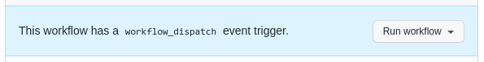

class: middle, center

# Introduction to GitHub Actions

Lars Kellogg-Stedman <lars@redhat.com>

.nodecoration[
- Slides: <http://oddbit.com/intro-to-github-actions/>
- Source: <https://github.com/larsks/intro-to-github-actions>
]

---

# What are GitHub Actions?

Actions let you run code on GitHub in response to certain events

---

# What are GitHub Actions?

Actions let you run code on GitHub in response to certain events

Such as:

- Pushes (whenever code is pushed to the repository)
- Pull requests (when someone creates a pull request)
- Schedule (run on a regular schedule, like cron)

But there are [many, many][] others.

[many, many]: https://docs.github.com/en/actions/using-workflows/events-that-trigger-workflows

---

# How do they work?

Actions are combined into "workflows" which are described by [YAML][] files that live in `.github/workflows` in your repository. For example, looking at the Operate First [apps][] repository:

```
$ tree .github
.github/
└── workflows
    └── book.yml
```

(Lots of details in the complete [syntax reference][])

[yaml]: https://en.wikipedia.org/wiki/YAML
[apps]: https://github.com/operate-first/apps/tree/master/.github/workflows
[syntax reference]: https://docs.github.com/en/actions/using-workflows/workflow-syntax-for-github-actions

---

# Basic structure

- Check out your code
- Configure language environment
- Install dependencies
- Do The Thing

---

# Example 1: the deploy-book workflow

Our first example comes from the [`apps` repository][deploy-book].

[deploy-book]: https://github.com/operate-first/apps/blob/master/.github/workflows/book.yml

```
name: deploy-book

# Only run this when the master branch changes
on:
  push:
    paths:
      - 'docs/**'
    branches:
      - 'master'
  workflow_dispatch:
```

This runs on pushes to the `master` branch if they modify a file in the `docs` directory.

---

# Example 1: the deploy-book workflow

The `workflow_dispatch` event means this also can be triggered manually.



---

# Example 1: the deploy-book workflow

A workflow consists of one or more jobs, and each job consists of a series of
steps.

```
# This job installs dependencies, build the book, and pushes it to `gh-pages`
jobs:
  deploy-book:
    runs-on: ubuntu-latest
```

This job runs in the `ubuntu-latest` environment. Other choices include MacOS and Windows. You can also [bring your own container][container].

[container]: https://docs.github.com/en/actions/using-jobs/running-jobs-in-a-container

---

# Example 1: the deploy-book workflow

```
    concurrency:
      group: deploy_environment
      cancel-in-progress: true
```

The `concurrency` setting prevents multiple instances of this job from running at the same time, and the `cancel-in-progress` setting means that when a new workflow run is triggered it will cancel any existing workflow runs.

---

# Example 1: the deploy-book workflow

```
    steps:
      - uses: actions/checkout@v2
```

Workflow steps can used predefined "actions". These are reusable chunks of code provided by third parties; the `actions/` namespace comes from GitHub, but anyone (even you!) can provide actions.

The `actions/checkout@v2` action checks out the current repository into a local directory.

---

# Example 1: the deploy-book workflow

```
      # Install dependencies
      - name: Set up Python 3.7
        uses: actions/setup-python@v1
        with:
          python-version: 3.7

      - name: Install dependencies
        run: |
          pip install -r docs/requirements.txt
```

This is a Python-based workflow, so we need to install Python and then install any dependencies. Instead of running predefined actions, a step can specify a `run` script, which is just a Bash script (unless you explicitly set a different `shell` on the `step`).

---

# Example 1: the deploy-book workflow

For the final steps, we build the output using `jupter-book` and then use a third-party action ([peaceiris/actions-gh-pages][]) to publish the book to the github pages branch.

[peaceiris/actions-gh-pages]: https://github.com/peaceiris/actions-gh-pages

```
      # Build the book
      - name: Build the book
        run: |
          jupyter-book build docs/

      # Push the book's HTML to github-pages
      - name: GitHub Pages action
        uses: peaceiris/actions-gh-pages@v3.5.9
        with:
          github_token: ${{ secrets.GITHUB_TOKEN }}
          publish_dir: docs/_build/html
```

---

# Interlude 1: Secrets

In the final step of the `deploy-book` workflow, there were a couple of parameters being passed to the `actions-gh-pages` action:

```
      - name: GitHub Pages action
        uses: peaceiris/actions-gh-pages@v3.5.9
        with:
          github_token: ${{ secrets.GITHUB_TOKEN }}
          publish_dir: docs/_build/html
```

The value of `github_token` is an example of using a GitHub secret.

---

# Interlude 1: Secrets

- The `GITHUB_TOKEN` secret is provided automatically; it grants access to the current repository. 
- You can define your own secrets at the [repository][] level, the [environment][] level, and the [organization][] level.
- Useful for providing credentials to access other services (container image registries, web services, etc)

[repository]: https://docs.github.com/en/codespaces/managing-codespaces-for-your-organization/managing-encrypted-secrets-for-your-repository-and-organization-for-codespaces#adding-secrets-for-a-repository
[environment]: https://docs.github.com/en/actions/deployment/targeting-different-environments/using-environments-for-deployment
[organization]: https://docs.github.com/en/codespaces/managing-codespaces-for-your-organization/managing-encrypted-secrets-for-your-repository-and-organization-for-codespaces#adding-secrets-for-an-organization

---

# Example 2: Running pre-commit checks

A common use case for GitHub workflows is to run some basic checks on pull requests. The following workflow makes use of the [pre-commit][], which applies checks define in a `.pre-commit-config.yaml` file.

This example from the [OpenShift on NERC][] project.

[pre-commit]: https://pre-commit.com/
[openshift on nerc]: https://github.com/OCP-on-NERC/workflows/blob/main/.github/workflows/precommit.yaml

```
name: Run pre-commit checks

on:
  pull_request:
  workflow_call:
```

This workflow runs for pull requests (but can also be triggered manually).

---

# Example 2: Running pre-commit checks

```
jobs:
  run-linters:
    runs-on: ubuntu-latest
    steps:
      - name: Check out code
        uses: actions/checkout@v2

      - name: Setup Python
        uses: actions/setup-python@v2
        with:
          python-version: '^3.9'
```

We've seen all this before.

---

# Example 2: Running pre-commit checks

Installing dependencies can dramatically increase the runtime of your workflows. GitHub provides a caching mechanism that allows you to re-use content from previous workflow invocations.

```
      - name: Configure caching
        uses: actions/cache@v2
        with:
          path: ~/.cache/pre-commit
          key: precommit-${{ runner.os }}-${{ hashFiles('.pre-commit-config.yaml') }}
```

Here, we save the contents of the `~/.cache/pre-commit` directory. As long as `.pre-commit-config.yaml` doesn't change (and we're running on the same OS), we'll be able to re-use the cached data.

---

# Example 2: Running pre-commit checks

```
      - name: Install pre-commit
        run: |
          pip install pre-commit

      - name: Run linters
        run: |
          pre-commit run --all-files
```

Running `pre-commit` will install files into `~/.cache/pre-commit`. When the workflow is complete, a post-run task will take care of archiving that directory with cache key we defined earlier.

---

# Interlude 2: Pre-commit

- The `pre-commit` tool comes with a number of built-in checks, and it can also source checks from external repositories.
- Checks to run are defined in a `.pre-commit-config.yaml` file, which is included in your repository.
- Developers can configure `pre-commit` as a `git` `pre-commit` hook by simply running `pre-commit install`.

---

# Interlude 2: Pre-commit

Some checks we commonly run in Operate First repositories:

```
  - repo: https://github.com/pre-commit/pre-commit-hooks
    rev: v3.3.0
    hooks:
      - id: trailing-whitespace
      - id: check-merge-conflict
      - id: end-of-file-fixer
      - id: check-added-large-files
      - id: check-case-conflict
      - id: check-json
      - id: check-symlinks
      - id: detect-private-key
```

These flag a number of basic problems, such as leaving merge conflict markers in your files, forgetting to clean up trailing whitespace, accidentally included private keys in the repository, etc.

---

# Interlude 2: Pre-commit

We often work with YAML files, so we use the `yamllint` tool to detect a number of common problems.

```
  - repo: https://github.com/adrienverge/yamllint.git
    rev: v1.25.0
    hooks:
      - id: yamllint
        files: \.(yaml|yml)$
        types: [file, yaml]
        entry: yamllint --strict -c yamllint-config.yaml
```

The behavior of `yamllint` is controlled by a configuration file (typically `.yamllint.yaml`, but in this case `yamllint-config.yaml`.

---

# Running jobs in a container

Instead of running commands in GitHub's default execution environment, you can run [your jobs][] or [individual steps][] in a custom container. For example:

```
jobs:
  testbox:
    runs-on: ubuntu-latest
    container:
      image: azul/zulu-openjdk-alpine:8-jre
    steps:  
    - uses: actions/checkout@v2
    - name: What OS is running
      run: uname -a
    - name: What java version do we have
      run: java -version
```

[individual steps]: https://docs.github.com/en/actions/using-workflows/workflow-syntax-for-github-actions#example-using-a-docker-hub-action
[your jobs]: https://docs.github.com/en/actions/using-jobs/running-jobs-in-a-container

---

# Running jobs in a container

- Good if you have a complex set of dependencies
- Provides consistent execution environment between GitHub actions and your local machine

---

# Workflows can be shared!

A [recent change][] introduced reusable workflows, so you can build a library of workflows instead of having to duplicate code in every project.

[recent change]: https://github.blog/2021-11-29-github-actions-reusable-workflows-is-generally-available/

[For example][]:

[for example]: https://github.com/OCP-on-NERC/workflows/blob/main/.github/workflows/precommit.yaml

```
name: Run pre-commit checks

on:
  pull_request:
  workflow_call:  # <-- the magic is here!
```

---

# Workflows can be shared!

Now we can include this workflow in another repository:

```
name: Run pre-commit checks

on:
  pull_request:

jobs:
  run-linters:
    uses: ocp-on-nerc/workflows/.github/workflows/precommit.yaml@main
```

---

# Workflows can be shared!

- Fewer things to update/fix
- More consistency
- Less time spent looking up syntax
- Easier to use == more likely to use

---

# What else can we do with workflows?

- [Automate software releases](https://github.com/larsks/halberd/blob/main/.github/workflows/release.yml)
- [Automate issue labeling](https://github.com/cli/cli/blob/trunk/.github/workflows/issueauto.yml)
- [Build Docker images](https://github.com/acmesh-official/acme.sh/blob/master/.github/workflows/dockerhub.yml)
- [Publish a website](https://github.com/openshift/node-feature-discovery/blob/master/.github/workflows/gh-pages.yml)
- [Publish DNS changes](https://github.com/larsks/oddbit-dns/blob/main/.github/workflows/update-dns.yaml)
- [Automate project boards](https://github.com/CCI-MOC/sprint-tools/blob/master/.github/workflows/create-sprint-board.yml)

---

# Questions

**What are best practices for setting up environment vs. repository secrets
(and the functional difference between the two) for GH Actions?** (cburkhar)

  - Repository secrets are available to all workflows in a repository.
  - Environment secrets are only available to workflows that target that particular environment.
      - E.g, you have one workflow that triggers on non-`main` pushes that deploys
        code to your test environment.
      - A separate workflow for pushes to `main` that deploys to production environment.
      - Environments let you have different settings for the two environments while otherwise using the same workflows.
  - See "[Use environments for deployments][]" for more information.

[use environments for deployments]: https://docs.github.com/en/actions/deployment/targeting-different-environments/using-environments-for-deployment

---

# Questions

**When should you and shouldn't use GitHub actions in your project? At what
point should a project consider using a GH workflow?** (bmontalv)

- Answers will be very subjective!
- Would your project benefit from automation?
- Things I use automation for in personal projects:

  - Creating software releases
  - Publishing a website
  - Pushing DNS changes

- Automated checks on pull requests are useful (a) as soon as you have one or more collaborators, or (b) if you're really disciplined about making changes through pull requests.
